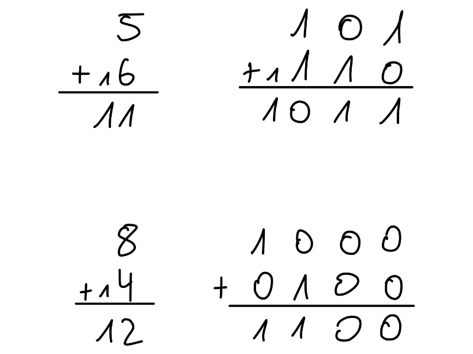
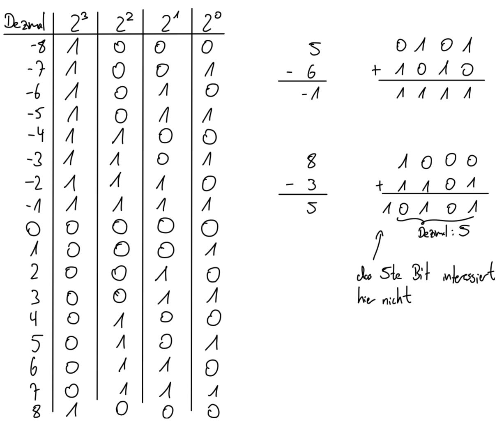
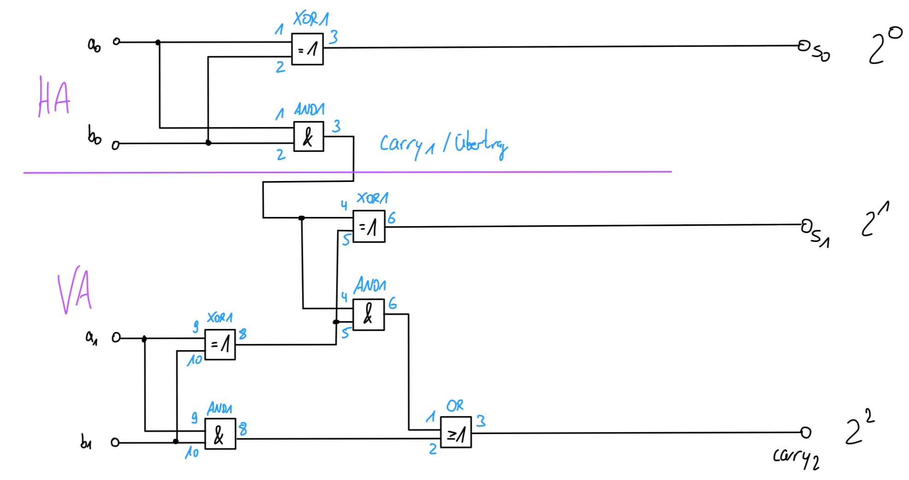
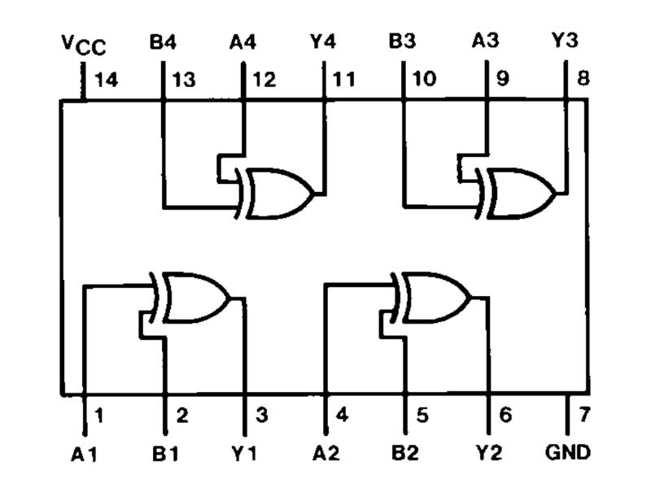
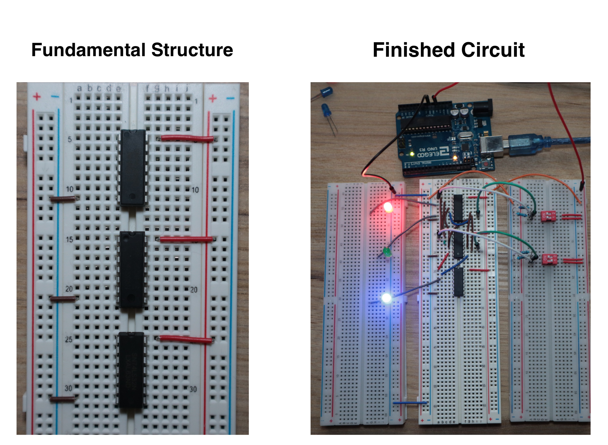
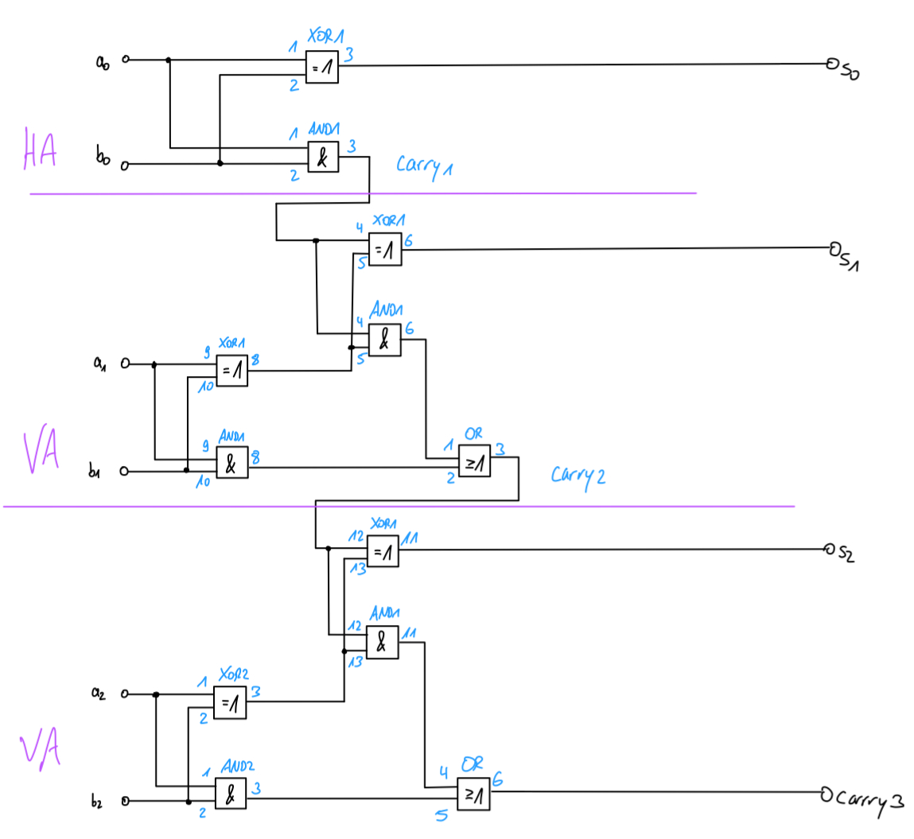
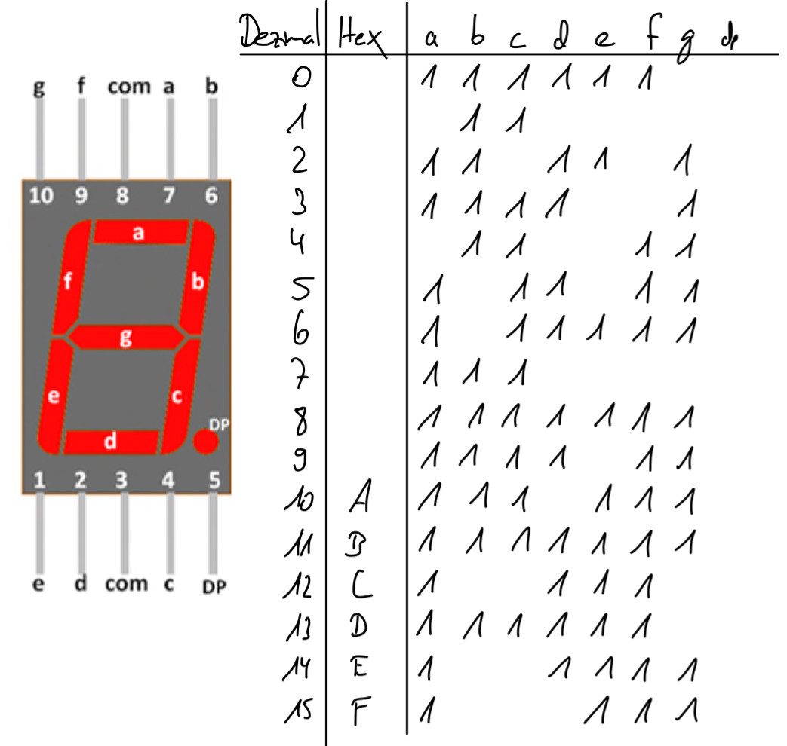

# 2-Bit and 3-Bit Binary Adder with 7-Segment Display

A hardware + Arduino project implementing binary adder circuits using 74LS-series logic gates. An Arduino reads the sum outputs and drives a 7-segment display to show the result in decimal.

---

## Binary Addition

Binary addition follows the same carry rules as decimal addition. When adding two 1-bits the result overflows a single bit, producing a carry - exactly like carrying a digit in long addition.

### Negative Numbers - Two's Complement

The same adder circuit works for signed numbers using **two's complement**. To represent a negative number: invert all bits of the positive value, then add 1.

**Example:** +1 in 4 bits is `0001`. Invert → `1110`, add 1 → `1111` = −1.

---

## 2-Bit Adder

The 2-bit adder consists of one **half adder** and one **full adder**. It adds two 2-bit numbers and produces a 3-bit result (two sum bits + one carry), covering the range **0 – 6**.

### Circuit Diagram

*Blue numbers indicate IC pin numbers for inputs and outputs.*

Pin assignments are read from the component's datasheet. The excerpt below is from the **74LS86** (XOR gate):

*A/B = inputs, Y = outputs, pin 7 = GND, pin 14 = VCC.*

### Assembled Circuit

---

## 3-Bit Adder

The 3-bit adder extends the 2-bit design with a second full adder. It adds two 3-bit numbers (0 – 7 each), producing a 4-bit output (carry + 3 sum bits), covering sums from **0 – 14**.

### Circuit Diagram

The carry output of each stage feeds directly into the XOR and AND gates of the next stage.

### Assembled Circuit

---

## 7-Segment Display

The Arduino reads the digital output pins of the adder, converts the binary value to decimal, and drives a common-cathode 7-segment display.

### Display Logic Table

For **negative results** in the 3-bit adder, the decimal point (dp) lights up as a substitute minus sign - since the display has no dedicated minus segment.

---

## Arduino Code

| Sketch | Description |
|--------|-------------|
| [`2bit_adder_7segment/`](2bit_adder_7segment/2bit_adder_7segment.ino) | Reads 3-bit sum, displays 0 – 6 |
| [`3bit_adder_7segment/`](3bit_adder_7segment/3bit_adder_7segment.ino) | Reads 4-bit output, displays −8 to +7 |

### How It Works

1. Read the adder's output pins using `digitalRead`
2. Combine the bits into a decimal value using bit shifts (e.g. `(b2 << 2) | (b1 << 1) | b0`)
3. Look up the segment pattern from a compact byte array
4. Write each segment pin HIGH or LOW using a single loop

The 3-bit sketch interprets the 4-bit output as a **two's-complement signed integer** (−8 to +7). A negative value lights the decimal point as a minus indicator.

---

## Pin Connections

### 2-Bit Adder

| Arduino Pin | Connected to |
|-------------|--------------|
| 3 | Sum bit 2 (2²) |
| 4 | Sum bit 1 (2¹) |
| 5 | Sum bit 0 - LSB (2⁰) |
| 6 | Display dp |
| 7 – 13 | Display segments a – g |

### 3-Bit Adder

| Arduino Pin | Connected to |
|-------------|--------------|
| 2 | Carry bit - MSB / sign bit |
| 3 | Sum bit 2 (2²) |
| 4 | Sum bit 1 (2¹) |
| 5 | Sum bit 0 - LSB (2⁰) |
| 6 | Display dp (minus indicator) |
| 7 – 13 | Display segments a – g |

---

## Components

| Component | Quantity | Purpose |
|-----------|----------|---------|
| Arduino Uno | 1 | Reading adder outputs, driving display |
| 74LS86 (XOR) | 2 | XOR gates for adder logic |
| 74LS08 (AND) | 1 | AND gates for carry generation |
| Common-cathode 7-segment display | 1 | Decimal result output |
| Resistors, breadboard, jumper wires | - | Wiring |
